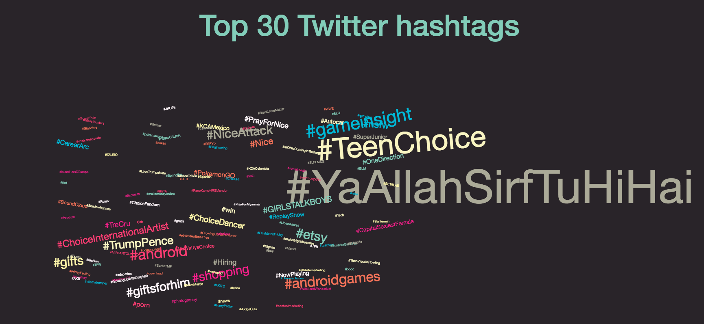

## Twitter Top 30 Hashtags
### Real-Time Analytics with Storm

Experiment with Apache Strom. Real-time, dynamic visualisation of tweets that contain worldwide top hashtags
(written in English). See Udacity's [Real-Time Analytics with Apache Storm](https://www.udacity.com/course/real-time-analytics-with-apache-storm--ud381).

To run it, you'll need [VirtualBox](https://www.virtualbox.org/wiki/Downloads) and [Vagrant](https://www.vagrantup.com/).

Clone the repo
```
git clone https://github.com/snknikolov/twitter-top-hashtags.git && cd twitter-top-hashtags
```
Boot up with:
``` 
vagrant up
```
SSH into the virtual machine with:
```
vagrant ssh
```

Go to the vagrant folder, compile and package: 
```
cd /vagrant && mvn package
```

Then run the Flask server using:
```
cd viz && python app.py
```

Open a new terminal tab and connect to the VM again
```
vagrant ssh
```

Finally, submit the topology:
```
cd /vagrant
storm jar target/storm-real_time_analytics-0.0.1-SNAPSHOT-jar-with-dependencies.jar storm.starter.storm_real_time_analytics.TopNTweetTopology
```

Demo:
